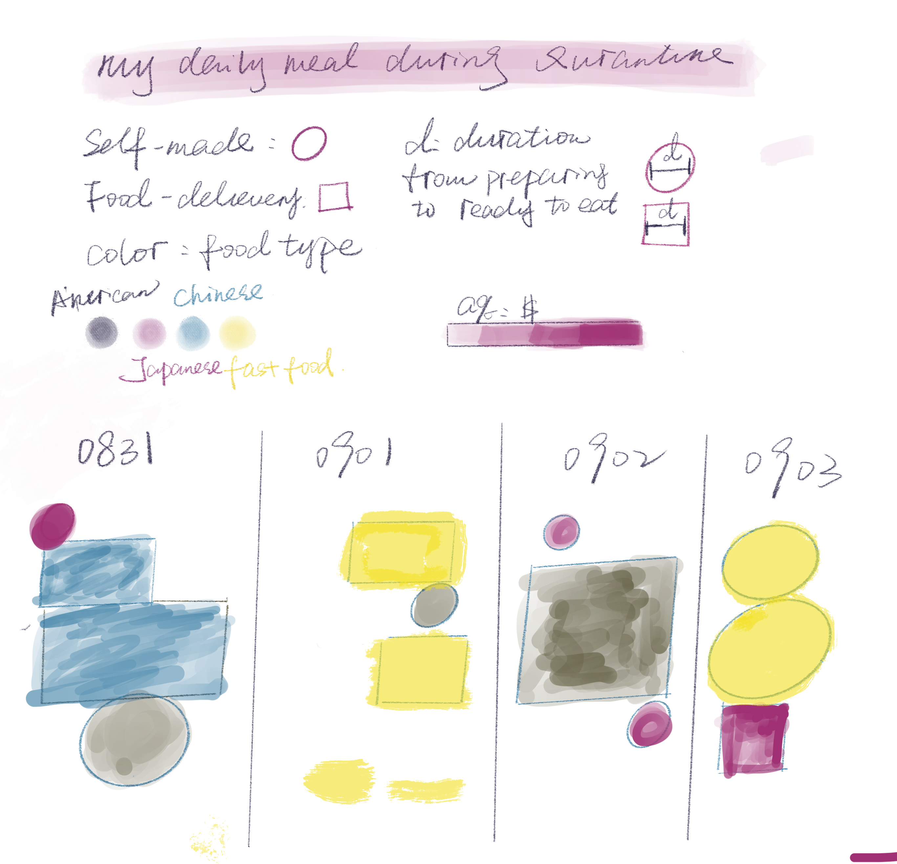
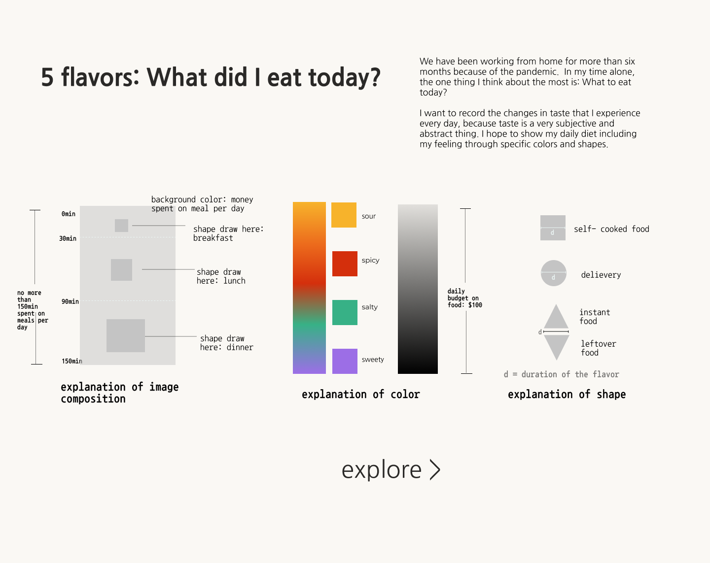
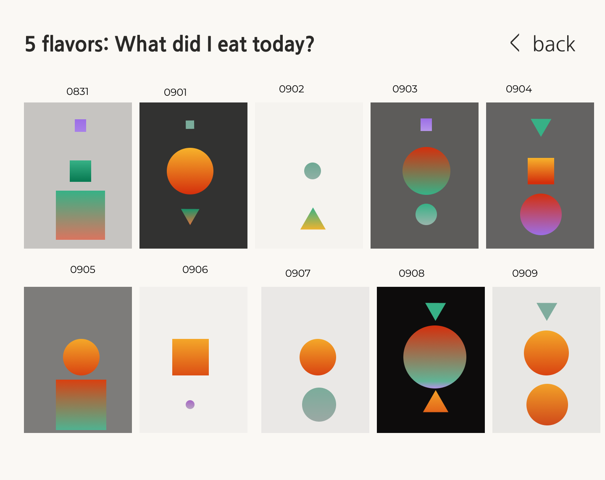
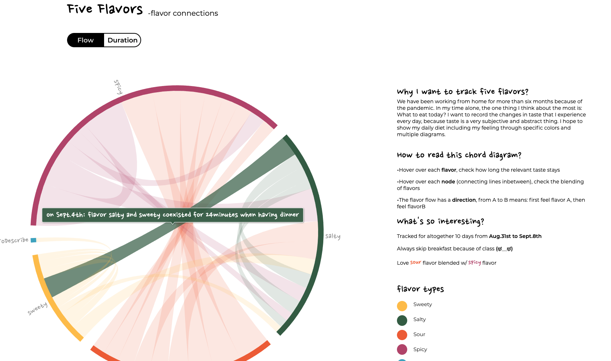
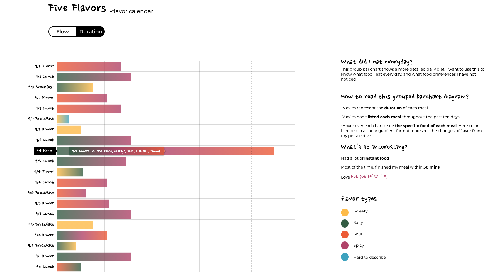

## Topic:
We have been working from home for more than six months because of the pandemic. In my time alone, the one thing I think about the most is: What to eat today? I want to record the changes in taste that I experience every day because the taste is a very subjective and abstract thing. I hope to show my daily diet including my feeling through specific colors and different charts
## Data: 
from Aug 31st to Sept 8th, ten days of daily meal including the flavors, food, meal, and duration of each meal
[Click here for the original data](https://docs.google.com/spreadsheets/d/1rSRXCI_31VNGeu5Dp2xzU_Gzm1gb--bdyyNXUN0ANEg/edit?usp=sharing)

## Desigin：
#### Sketch:
My original plan is to use different shape. but the feedback I received are that they are too abstract to be understood. For data visualization, the top goal for me is to make the data understandavle then follows the visually appealing abbilities. 

#### Iterations:
It is made entirely through Figma. I like this overall outcome, but at the same time, I feel that the data is not intuitive enough and need to rely on special detailed legend. This is not smart enough as a intuitive data visualization, so I decided to continue to use color gradient, but use different chart types to represent the theme of flavor flow.

#### Font and Color
Personal data tracking, so I choose this kinda kid-ish font, and bright color palatte to list some interesting findings for my data visualizations here. 

## Programming:
#### Part 1: Chord diagram to represent the flow of flavor：
Why I want to use chord diagram?
Flavor is not static, it has a process of change, and it is usually difficult to distinguish a single flavor. In the last draft, the feedback on the color gradient was good, but it lacks intuitive numbers to indicate which flavor stays the longest (that is, what flavor of food I like most), so this time through the chord chart,The flow of flavor as well as which flavor is the most popular one can be seen clearly. 

How to read this chord diagram?
-Hover over each flavor, check how long the relevant taste stays
-Hover over each node (connecting lines inbetween), check the blending of flavors
-The flavor flow has a direction, from A to B means: first feel flavor A, then feel flavorB
What's so interesting?
Tracked for altogether 10 days from Aug.31st to Sept.8th
Always skip breakfast because of class (ಥ﹏ಥ)
Love sour flavor blended w/ spicy flavor

#### Part 2: grouped bar chart
What did I eat everyday?
This group bar chart shows a more detailed daily diet. I want to use this to know what food I eat every day, and what food preferences I have not noticed
How to read this grouped barchart diagram?
-X axies represent the duration of each meal
-Y axies node listed each meal throughout the past ten days
-Hover over each bar to see the specific food of each meal. Here color blended in a linear gradient format represent the changes of flavor from my perspective
What's so interesting?
Had a lot of instant food
Most of the time, finished my meal within 30 mins
Love hot pot (*´∇｀*)

